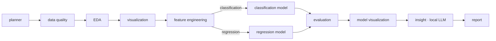
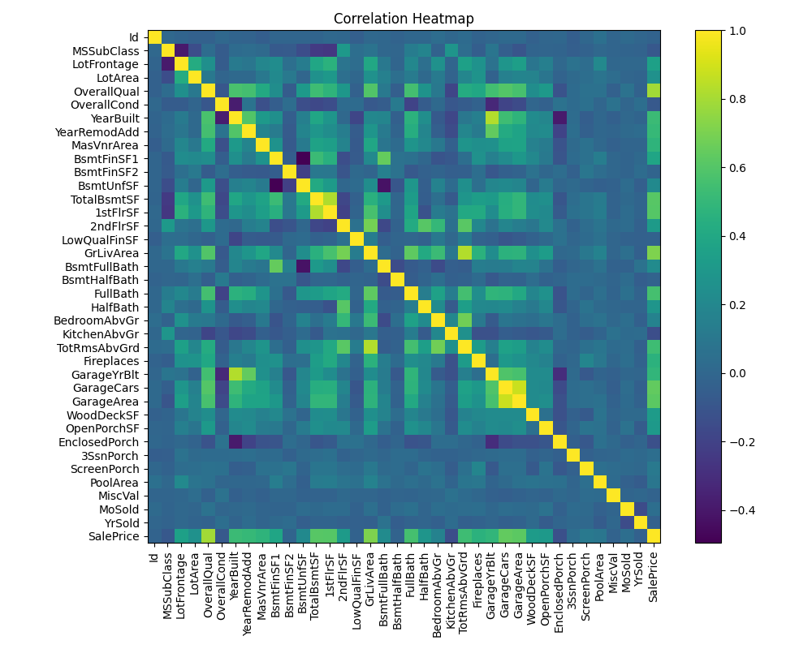
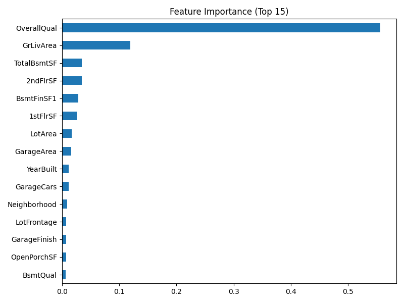

# InsightForge-AI

An agentic, **local-first** machine-learning analyst. Upload a CSV, pick a target column, and a multi-agent pipeline automatically profiles the data, engineers features, **picks the right model type (classification or regression)**, trains and compares models, evaluates them, draws charts, and writes plain-English insights — all powered by a **local LLM (Ollama)**, with a clean tabbed Streamlit UI.

Built milestone-by-milestone with [LangGraph](https://github.com/langchain-ai/langgraph) for orchestration. No external API keys required — the LLM runs on your machine.

---

## ✨ Features

- **Dynamic routing** — a planner agent inspects the target column and routes to a **classification** or **regression** branch automatically.
- **End-to-end pipeline** — data quality → EDA → visualization → feature engineering → modeling → evaluation → insights → report.
- **Model comparison** — trains Logistic/Linear Regression, Decision Tree, and Random Forest, then reports the best by accuracy (classification) or R² (regression).
- **Auto visualizations** — missing-values chart, correlation heatmap, target distribution, and Random-Forest feature importance.
- **Local LLM insights** — an Ollama-backed agent turns the results into business-readable takeaways (degrades gracefully if the LLM is unavailable).
- **Persistent memory** — every run is saved to a local SQLite database and shown in a "Past Runs" table.
- **Conversational Q&A** — ask natural-language questions about your data (column stats) and your run history (SQL), via Ollama tool-calling.
- **MCP integration** — query files in `./data` through a Model Context Protocol filesystem server.

---

## 🧠 Pipeline



The planner sets `problem_type` from the target's cardinality (`nunique <= 10` → classification, else regression); a LangGraph conditional edge routes to the matching model agent, and both branches rejoin at evaluation.

---

## 🖼️ Example output

Charts are generated automatically by the visualization agents (shown here for the House Prices dataset):

| Correlation heatmap | Feature importance (Random Forest) |
|---|---|
|  |  |

> In the app, everything is organized into tabs — Dataset, Report, Feature Engineering, Model & Evaluation, Visualizations, AI Insights — plus a Past Runs table and two Q&A boxes.

---

## 🛠️ Tech stack

- **Python 3.14**
- **Streamlit** — UI
- **LangGraph** — multi-agent orchestration
- **pandas / scikit-learn / matplotlib** — data + modeling + charts
- **Ollama** (`llama3.1:8b`) — local LLM for insights and Q&A
- **SQLite** (stdlib) — run history
- **MCP** (`@modelcontextprotocol/server-filesystem` via `npx`) — filesystem tool access

---

## 📋 Prerequisites

1. **Python 3.14** (project venv targets 3.14).
2. **[Ollama](https://ollama.com)** installed and running, with the model pulled:
   ```bash
   ollama pull llama3.1:8b
   ```
3. **Node.js / npx** (only needed for the MCP feature).

---

## 🚀 Setup

```bash
# from the project root
python3.14 -m venv venv
./venv/bin/pip install --upgrade pip
./venv/bin/pip install -r requirements.txt
```

> This project pins to a Python 3.14 virtual environment. Invoke tools via `./venv/bin/python ...` rather than relying on shell activation.

---

## ▶️ Usage

Start the app:

```bash
./venv/bin/python -m streamlit run app.py
```

Then in the browser (default http://localhost:8501):

1. **Upload a CSV** (sample datasets like Titanic or Ames House Prices work great).
2. **Select the target column** — a banner shows the detected problem type.
3. Explore the **tabs**: Dataset, Report, Feature Engineering, Model & Evaluation, Visualizations, AI Insights.
4. Review **Past Runs** — every analysis is saved and listed.
5. Use the **Q&A boxes**:
   - *"Ask a question about your data or past runs"* → column stats + run-history SQL.
   - *"Ask via MCP"* → file questions answered through the filesystem MCP server.

> Local-LLM note: insight generation and Q&A make on-device calls to `llama3.1:8b` (~4.9 GB). Expect ~30–100s per LLM response depending on dataset size, and run **one LLM request at a time**.

---

## 📂 Project structure

```
InsightForge-AI/
├── app.py                       # Streamlit UI (tabs, Past Runs, Q&A boxes)
├── workflow/
│   ├── graph.py                 # LangGraph pipeline + dynamic routing
│   └── state.py                 # shared AgentState
├── agents/
│   ├── planner_agent.py             # detects classification vs regression
│   ├── data_quality_agent.py        # rows, columns, missing, duplicates
│   ├── eda_agent.py                 # summary statistics
│   ├── feature_engineering_agent.py # encoding/scaling/imputation recommendations
│   ├── classification_model_agent.py
│   ├── regression_model_agent.py
│   ├── evaluation_agent.py          # accuracy/precision/recall/f1 | MAE/RMSE/R²
│   ├── visualization_agent.py       # missing values, correlation, target dist
│   ├── model_visualization_agent.py # feature importance (Random Forest)
│   ├── report_agent.py              # assembles the final text report
│   └── insight_agent.py             # local-LLM business insights
├── utils/
│   ├── llm.py                   # Ollama chat wrapper
│   ├── db.py                    # SQLite run history
│   ├── tools.py                 # tool-calling Q&A (column stats + SQL)
│   └── mcp_client.py            # MCP filesystem client
├── data/                        # your CSVs (gitignored)
├── reports/visualizations/      # generated charts (gitignored)
└── requirements.txt
```

---

## 🗺️ Release history

| Version | Milestone |
|---------|-----------|
| v1.0.0 | Initial multi-agent workflow |
| v1.1.0 | Feature engineering agent |
| v1.2.0 | Model agent (classifier comparison) |
| v1.3.0 | Evaluation agent |
| v2.0.0 | Dynamic routing (classification ⇄ regression) |
| v2.1.0 | Visualization agents |
| v3.0.0 | Local LLM insight agent (Ollama) |
| v3.0.1 | Graceful LLM-failure handling |
| v4.0.0 | Memory layer (SQLite run history) |
| v5.0.0 | Tool-calling Q&A agent |
| v6.0.0 | MCP integration |

---

## 📝 Notes

- **No data is committed** — `data/*` and generated artifacts (`reports/visualizations/*.png`, `insightforge.db`) are gitignored.
- **Fully local** — no cloud LLM keys needed; everything runs against your local Ollama instance.
- The filesystem MCP server handles **file operations** (read/list), not data analysis — use the data Q&A box for analytical questions.
